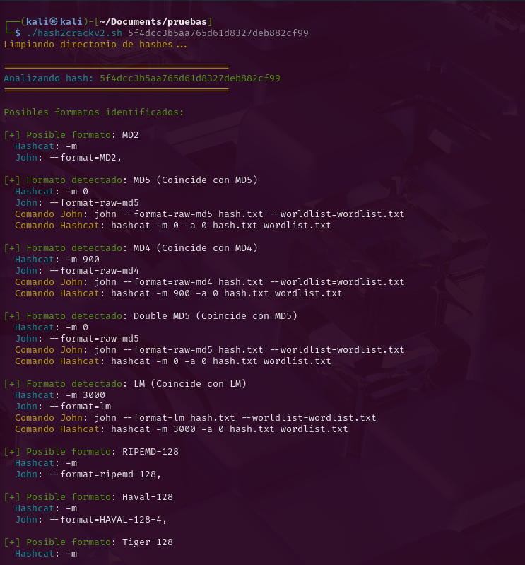
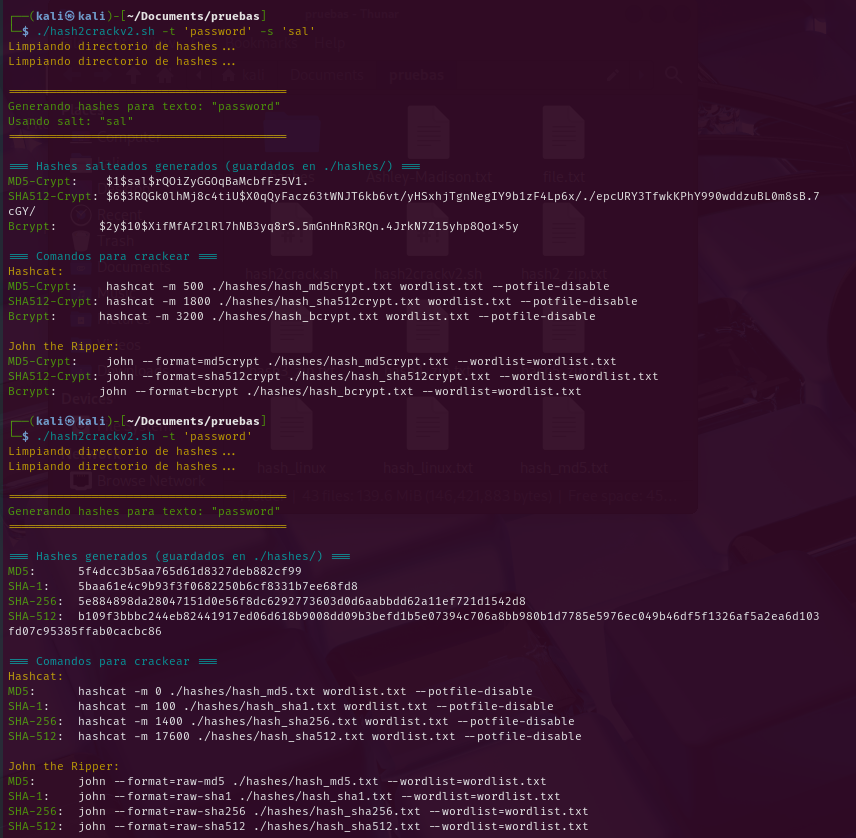

# hash2crack

# 🔐 Identificador y Asistente de Hashes para John the Ripper y Hashcat

Este script en Bash permite identificar automáticamente el tipo de hash ingresado y generar los comandos correspondientes para utilizarlo con herramientas de fuerza bruta como **John the Ripper** y **Hashcat**. También permite generar hashes comunes con o sin salt.

---

## 📦 Requisitos

Antes de usar el script, asegúrate de tener instaladas las siguientes herramientas:

- `bash` (intérprete de shell)
- `john` (John the Ripper)
- `hashcat`
- `hashid`
- `openssl`
- `mkpasswd` (opcional, usualmente parte del paquete `whois`)
- `htpasswd` (opcional, parte de `apache2-utils` o `httpd-tools`)

Instalación de dependencias en Kali, Debian/Ubuntu:

```bash
sudo apt update
sudo apt install john hashcat hashid whois apache2-utils
```

# Como usar

## 1. Clona este repositorio o descarga el script

```bash
git clone https://github.com/MauricioCH2/hash2crack.git
cd hash2crack
# Dale perfi
chmod +x hash2crack.sh
```

## 2. (Opcional) Crear un alias para usar el script desde cualquier lugar

Para **bash**:

```bash
echo 'alias hash2crack="$HOME/hash2crack/hash2crack.sh"' >> ~/.bashrc && source ~/.bashrc
```

Para **zsh**:

```bash
echo 'alias hash2crack="$HOME/hash2crack/hash2crack.sh"' >> ~/.zshrc && source ~/.zshrc
```

# Actualmente el script contiene funciones listas para:

- Identificar un hash y sugerir comandos:

```bash
hash2crack "hash_a_identificar"
```

- Identificar multiples hashes

```bash
hash2crack archivo_con_hahses
```

- Generar hashes con o sin salt:

```
hash2crack -t "texto_a_hashear"
hash2crack -t "texto_a_hashear" -s "salt"
```

📸 Ejemplos de uso
Ejemplo 1: Identificación de hash



Ejemplo 2: Generación de hashes con y sin "sal"



🛠 Funcionalidades
✅ Identificación automatizada por hashid
✅ Detección por longitud si hashid falla
✅ Sugerencias de comandos basica para John y Hashcat
✅ Limpieza de archivos .pot de sesiones anteriores
✅ Generación de hashes (MD5, SHA-1, SHA-256, SHA-512, bcrypt, etc.)

🧑‍💻 Autor
Este script fue desarrollado por Mauricio Chaves a modo de estudio y como parte de extra proyecto académico de análisis y pruebas de hash.

⚠️ Aviso
Este script es solo para fines educativos y de pruebas en entornos controlados. No debe ser utilizado para actividades ilegales o sin autorización explícita.
